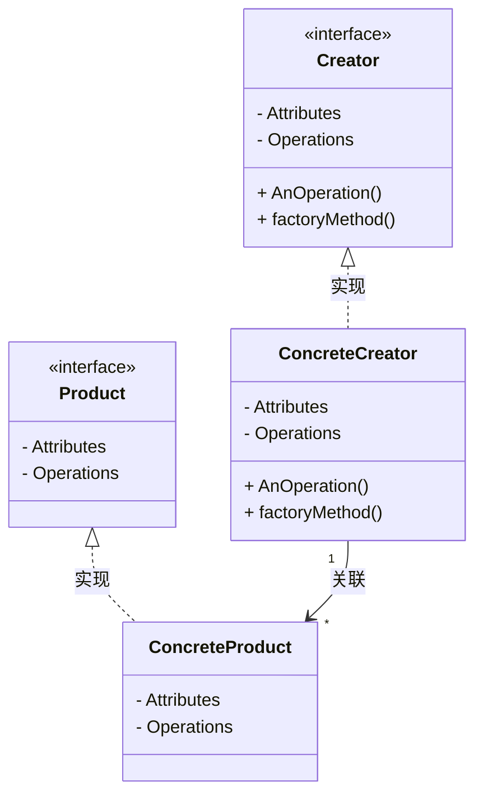
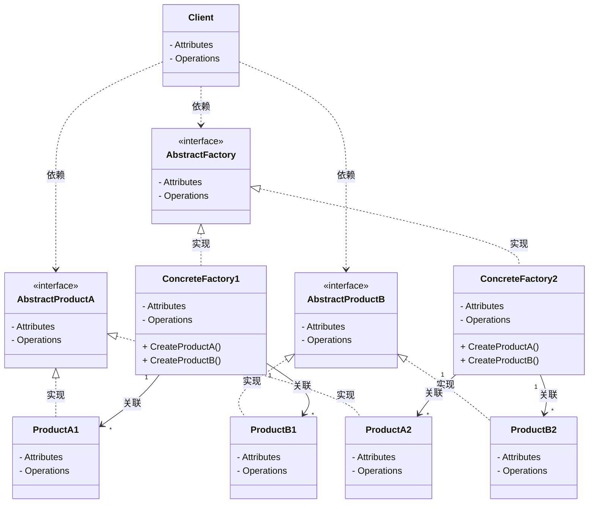
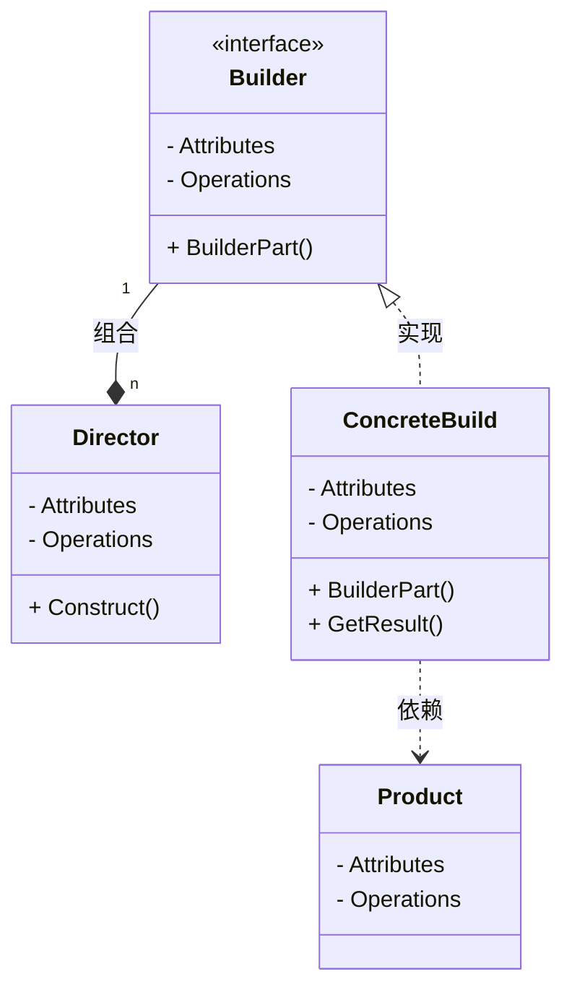
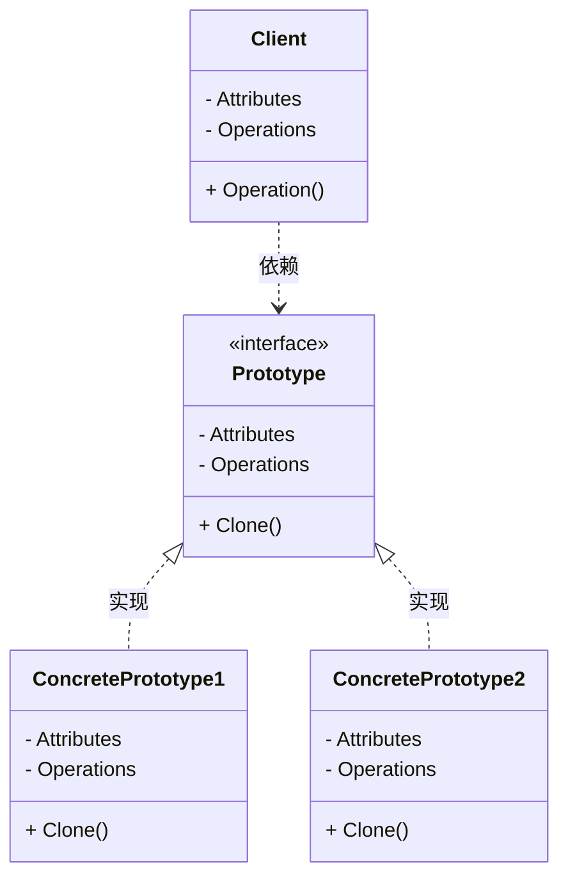
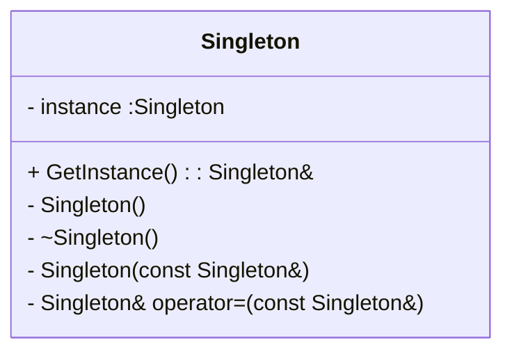

# 工厂模式

## UML类图

### 工厂模式

```mermaid
classDiagram
Product <|.. ConcreteProduct : 实现
Creator <|.. ConcreteCreator : 实现
ConcreteCreator "1" --> "*" ConcreteProduct : 关联
class Product {
	<<interface>>
	- Attributes
	- Operations
}
class ConcreteProduct {
	- Attributes
	- Operations
}
class Creator {
	<<interface>>
	- Attributes
	- Operations
	+ AnOperation()
	+ factoryMethod()
}
class ConcreteCreator {
	- Attributes
	- Operations
	+ AnOperation()
	+ factoryMethod()
}
```

### 抽象工厂模式

```mermaid
classDiagram
AbstractProductA <|.. ProductA1 : 实现
AbstractProductA <|.. ProductA2 : 实现
AbstractProductB <|.. ProductB1 : 实现
AbstractProductB <|.. ProductB2 : 实现
AbstractFactory <|.. ConcreteFactory1 : 实现
AbstractFactory <|.. ConcreteFactory2 : 实现
Client ..> AbstractFactory : 依赖
Client ..> AbstractProductA : 依赖
Client ..> AbstractProductB : 依赖
ConcreteFactory1 "1" --> "*" ProductA1 : 关联
ConcreteFactory2 "1" --> "*" ProductA2 : 关联
ConcreteFactory1 "1" --> "*" ProductB1 : 关联
ConcreteFactory2 "1" --> "*" ProductB2 : 关联
class AbstractProductA {
	<<interface>>
	- Attributes
	- Operations
}
class AbstractProductB {
	<<interface>>
	- Attributes
	- Operations
}
class ProductA1 {
	- Attributes
	- Operations
}
class ProductA2 {
	- Attributes
	- Operations
}
class ProductB1 {
	- Attributes
	- Operations
}
class ProductB2 {
	- Attributes
	- Operations
}
class AbstractFactory {
	<<interface>>
	- Attributes
	- Operations
}
class ConcreteFactory1 {
	- Attributes
	- Operations
	+ CreateProductA()
	+ CreateProductB()
}
class ConcreteFactory2 {
	- Attributes
	- Operations
	+ CreateProductA()
	+ CreateProductB()
}
class Client {
	- Attributes
	- Operations
}
```

### 生成器模式

```mermaid
classDiagram
Builder "1" --* "n" Director : 组合
Builder <|.. ConcreteBuild : 实现
ConcreteBuild ..> Product: 依赖

class Builder {
	<<interface>>
	- Attributes
	- Operations
	+ BuilderPart()
}
class ConcreteBuild {
	- Attributes
	- Operations
	+ BuilderPart()
	+ GetResult()
}
class Product {
	- Attributes
	- Operations
}
class Director {
	- Attributes
	- Operations
	+ Construct()
}
```

### 原型模式

```mermaid
classDiagram
Prototype <|.. ConcretePrototype1 : 实现
Prototype <|.. ConcretePrototype2 : 实现
Client ..> Prototype : 依赖

class Prototype {
	<<interface>>
	- Attributes
	- Operations
	+ Clone()
}
class ConcretePrototype1 {
	- Attributes
	- Operations
	+ Clone()
}
class ConcretePrototype2 {
	- Attributes
	- Operations
	+ Clone()
}
class Client {
	- Attributes
	- Operations
	+ Operation()
}
```

### 单例模式

```mermaid
classDiagram

class Singleton {
	- instance :Singleton
	+ GetInstance() : Singleton&
	- Singleton()
	- ~Singleton()
	- Singleton(const Singleton&)
	- Singleton& operator=(const Singleton&)
}
```