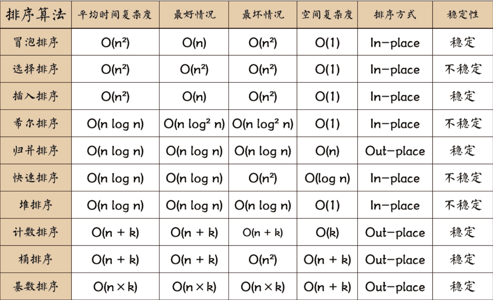
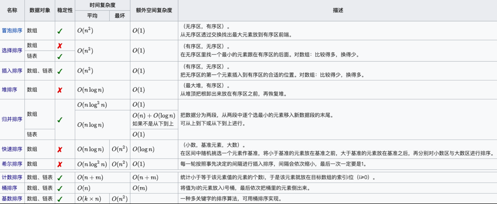

# 排序算法

CMake 项目管理

## 冒泡排序

原理：将最值**一步一步冒出**末端

- 从头到尾遍历，**比较相邻的两个元素**，如果**顺序是逆序**，**交换**两个元素。
- 每次遍历会将**遍历区间中最值**移动到**遍历区间的末端**，末端变为有序。
- 遍历区间会随着遍历次数的增加而减小。
  
实现文件：<a href="./src/sort/QBubbleSort.cpp" alt="冒泡排序">QBubbleSort.cpp</a>

## 选择排序

原理：**选择最值**摆放到末端

- 遍历数据，**记录最小/最大的数据的下标**，将**最值和末端元素交换**。
- 遍历区间随着遍历次数增加而减小，末端变为有序。

实现文件：<a href="./src/sort/QSelectionSort.cpp" alt="选择排序">QSelection.cpp</a>

## 插入排序

原理：遍历数据，将数据**插入有序的数组**中

- 第一个元素为**有序数组**，将从第二个元素开始的无序元素**插入到有序数组**中
- 在有序数组中用**折半查找**方法查找插入位置下标
- 将下标位置的**数据往后移**，再将元素放到下标位置

实现文件：<a href="./src/sort/QInsertionSort.cpp" alt="插入排序">QInsertionSort.cpp</a>

## 希尔排序

原理：插入排序的优化版本,添加增量将分组进行插入排序

- 第一个for循环,增量 数组长度/2,直到增量为1结束
- 第二个for循环,区间为增量大小,逐渐增多,直到区间扩大为原数组大小
- 第三个for循环,将区间内的元素,按照增量分组,比较排序

实现文件：<a href="./src/sort/QInsertionSort.cpp" alt="插入排序">QInsertionSort.cpp</a>

## 堆排序

大顶堆：每个节点的值都大于或等于其子节点的值，在堆排序算法中用于升序排列；
小顶堆：每个节点的值都小于或等于其子节点的值，在堆排序算法中用于降序排列；

原理：将数据组成**一个堆数据结构**

- 从**最后一个父节点**开始将数据**调整成堆结构**，子节点为 i*2+1。
- 因为组成堆结构，**第一个元素是堆顶**，是**最值**。将**第一个元素和最后一个元素**互换，最后一个元素元素脱离堆，元素数量 -1 **从新调整堆**。

堆的数据分布：
A=0|B=A*2+1|C=A*2+2|D=B*2+1|E=B*2+2|F=C*2+1|G=C*2+2

实现文件：<a href="./src/sort/QHeapSort.cpp" alt="堆排序">QHeapSort.cpp</a>

## 归并排序

原理：将数据**分割成 n 个有序队列**后，再将有序队列**合并**成一个队列

- 将队列**分割成 n 个队列**，直到一个队列只有一个元素，**队列为有序队列**；
- 将分割的队列合并成一个新的有序队列，直到将所有队列合并成一个。

两种实现方法:

- 递归法
- 迭代法
  
实现文件：<a href="./src/sort/QMergingSort.cpp" alt="归并排序">QMergingSort.cpp</a>

## 快速排序

原理：比基数大的放右边,小的放左边

- 取一个基数,将大于基数的放到左边,小于基数的放到右边,返回最终基数的下标
- 递归对基数左边区间做第一步的操作,直到区间只剩一个元素位为止
- 基数右边区间也按照第二部的操作执行

> 优化:
>
> - 三数取中
> - 挖坑法,双指针填坑
> - 小于阈值改用插入排序

实现文件：<a href="./src/sort/QQuickSort.cpp" alt="快速排序">QQuickSort.cpp</a>

## 计数排序

原理：统计数据出现的次数,再遍历统计数组将数据填入输出数组中

- 获取最大值和最小值,分配空间为最大值和最小值差值大小的数组
- 遍历统计数据出现的次数,将数据填入 i-min 中
- 从头到尾遍历,将统计数据整理成记录元素位置数组
- 从尾到头遍历,将统计数组中的位置存放数据

实现文件：<a href="./src/sort/QCountingSort.cpp" alt="计数排序">QCountingSort.cpp</a>

## 桶排序

原理：分配容量为b的n个桶,

- 容量为b的 (maxVal - minVal + b) / b 个桶
- 将数据按照 (val - minVal) / b 放入桶中
- 遍历多个桶,每个桶用其它排序方法进行桶内排序
- 将已经排好序的桶内数据存放到输出数组中

实现文件：<a href="./src/sort/QBucketSort.cpp" alt="桶排序">QBucketSort.cpp</a>

## 基数排序

原理：从个位 十位 ... 进行分桶,将个位排好序,十位排好序... 最终得到排好序的数组

- 获取最大值有多少位数,从个位开始遍历,十位再百位...
- 计算位数元素出现的个数
- 从头到尾遍历,将统计数据整理成记录元素位置数组
- 从尾到头遍历,将统计数组中的位置存放数据

实现文件：<a href="./src/sort/QRadixSort.cpp" alt="基数排序">QRadixSort.cpp</a>
